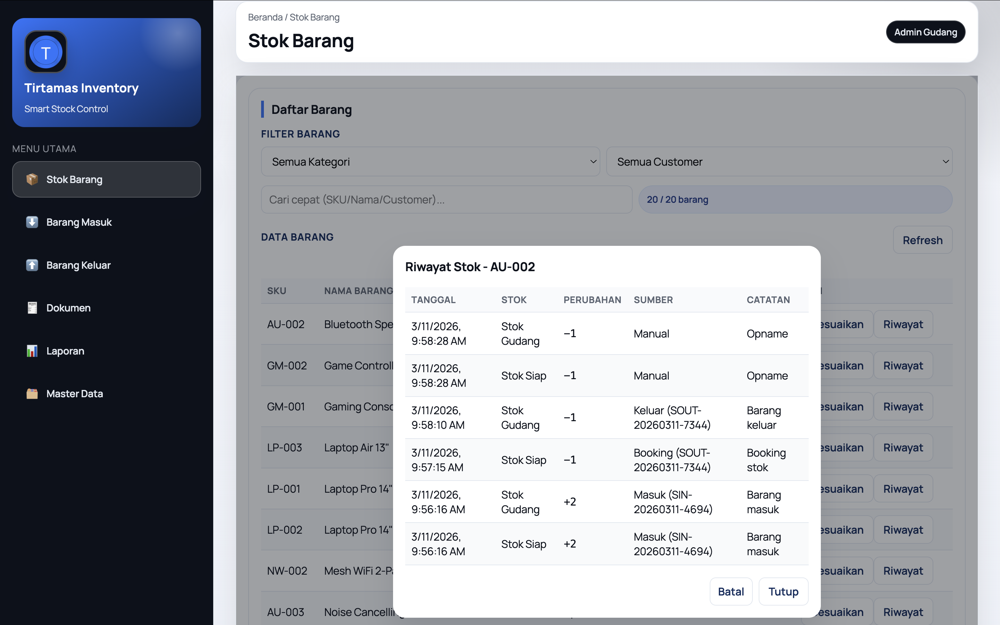
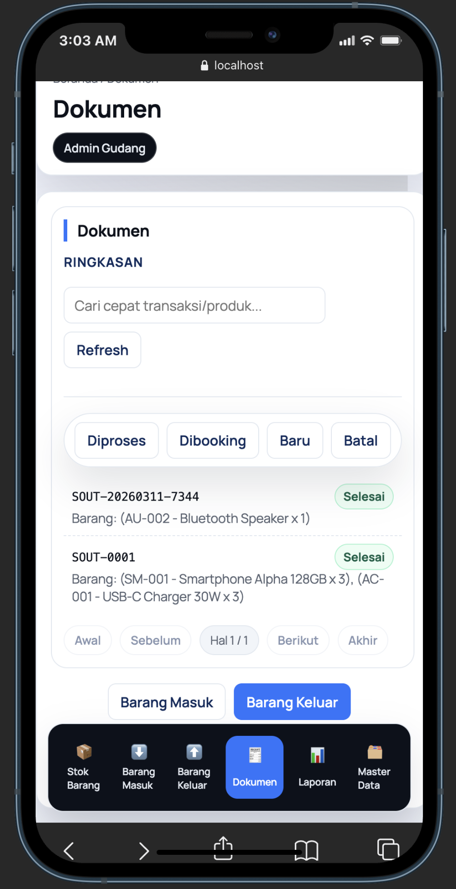

# Tirtamas Inventory

Repositori ini berisi dua aplikasi:
- Backend (Go + PostgreSQL) di folder `backend/`
- Frontend (React + Zustand) di folder `frontend/`

## Preview UI



## Gambaran Singkat
Backend memakai struktur berlapis (handler → service → repo) agar aturan bisnis rapi dan konsisten. Semua perubahan stok dijalankan dalam transaksi database. Sistem mendukung **read/write split**: transaksi selalu ke DB utama, sedangkan read bisa ke replica jika diset.

Frontend adalah halaman admin multi-page untuk gudang: daftar barang, barang masuk, barang keluar, laporan, dan master data.

---

## Backend

### Kebutuhan
- Go 1.21+
- PostgreSQL 13+

### Konfigurasi
Edit `backend/.env`:
```
HTTP_ADDR=:8080
DATABASE_URL=postgres://pips@localhost:5432/smart_inventory?sslmode=disable
READ_DATABASE_URL=postgres://pips@localhost:5432/smart_inventory_replica?sslmode=disable
API_KEY=your-secret-key
LOG_FILE=backend.log
GIN_MODE=release
```

Jika tidak memakai replica, kosongkan `READ_DATABASE_URL`.

### Migrasi & Seeder
Disarankan pakai Makefile (lebih ringkas). Script tetap tersedia.

```bash
cd backend

## lewat Makefile
make up
make seed
make status

## lewat script
./scripts/migrate.sh up

# seed data
./scripts/migrate.sh seed

# rollback 1 step
./scripts/migrate.sh down 1

# status migrasi
./scripts/migrate.sh status
```

### Menjalankan Server
```bash
cd backend
make run
```

Server default di `:8080`.

### Docker (Backend)
```bash
cd backend
docker build -t tirtamas-backend .
docker run --rm -p 8080:8080 \\
  -e DATABASE_URL="postgres://pips@host.docker.internal:5432/smart_inventory?sslmode=disable" \\
  -e READ_DATABASE_URL="" \\
  -e API_KEY="your-secret-key" \\
  tirtamas-backend
```

### Ringkas API
- `GET /inventory?name=&sku=&customer=`
- `POST /inventory/adjust` (by SKU)
- `GET /customers`
- `POST /customers`
- `GET /categories`
- `POST /categories`
- `GET /products`
- `POST /products`
- `POST /stock-ins`
- `POST /stock-ins/{code}/status`
- `GET /stock-ins?status=CREATED,IN_PROGRESS`
- `GET /stock-ins/code/{code}`
- `POST /stock-outs`
- `POST /stock-outs/{code}/allocate`
- `POST /stock-outs/{code}/status`
- `GET /stock-outs?status=DRAFT,ALLOCATED,IN_PROGRESS`
- `GET /stock-outs/code/{code}`
- `GET /reports/stock-ins?date_from=YYYY-MM-DD&date_to=YYYY-MM-DD`
- `GET /reports/stock-outs?date_from=YYYY-MM-DD&date_to=YYYY-MM-DD`

Semua request wajib header:
```
X-API-Key: <API_KEY>
```

---

## Frontend

### Kebutuhan
- Node 18+

### Konfigurasi
Edit `frontend/.env`:
```
VITE_API_URL=http://localhost:8080
VITE_API_KEY=your-secret-key
```

### Menjalankan
```bash
cd frontend
npm install
npm run dev
```

Halaman yang tersedia:
`http://localhost:5173/inventory`
`http://localhost:5173/stock-in`
`http://localhost:5173/stock-out`
`http://localhost:5173/documents`
`http://localhost:5173/reports`
`http://localhost:5173/master`

### Docker (Frontend)
```bash
cd frontend
docker build -t tirtamas-frontend .
docker run --rm -p 5173:80 \\
  -e VITE_API_URL="http://localhost:8080" \\
  -e VITE_API_KEY="your-secret-key" \\
  tirtamas-frontend
```

---

## Postman Collection
File koleksi Postman tersedia di `postman_collection.json`.

Langkah cepat:
1. Import file `postman_collection.json`.
2. Set variable:
   - `baseUrl` = `http://localhost:8080`
   - `apiKey` = sesuai `API_KEY` di backend

## Catatan Proses Stok (Sesuai Requirement)
- **Barang Masuk**: alur `CREATED → IN_PROGRESS → DONE`. Stok gudang **bertambah** hanya saat `DONE`.
- **Barang Keluar** (Two‑Phase):
  - **Booking**: `DRAFT → ALLOCATED` mengurangi **stok siap** (booking).
  - **Proses**: `ALLOCATED → IN_PROGRESS → DONE` mengurangi **stok gudang** saat `DONE`.
  - **Batal** saat `ALLOCATED/IN_PROGRESS` mengembalikan **stok siap**.
- **Inventory**: **Stok Gudang** = physical, **Stok Siap** = available (sudah dikurangi booking).
- **Laporan**: hanya menampilkan transaksi berstatus `DONE`.

---

## Alur Testing (End‑to‑End)
1. Jalankan backend + migrasi + seed.
2. Jalankan frontend.
3. **Inventory**: pastikan stok awal tampil.
4. **Barang Masuk**:
   - Buat dokumen, tambah item, simpan.
   - Ubah status: **Baru → Diproses → Selesai**.
   - Cek **Inventory**: stok gudang & siap bertambah.
5. **Barang Keluar**:
   - Buat dokumen, tambah item, simpan.
   - **Booking Stok** (stok siap berkurang).
   - Ubah status: **Dibooking → Diproses → Selesai** (stok gudang berkurang).
   - Uji **Batal** dari Diproses: stok siap kembali.
6. **Inventory → Riwayat Stok**:
   - Pastikan log muncul dari **Manual** dan **Proses**.
7. **Laporan**:
   - Pastikan hanya transaksi **Selesai** yang muncul.
   - Klik **Lihat Dokumen** lalu **Cetak PDF**.
